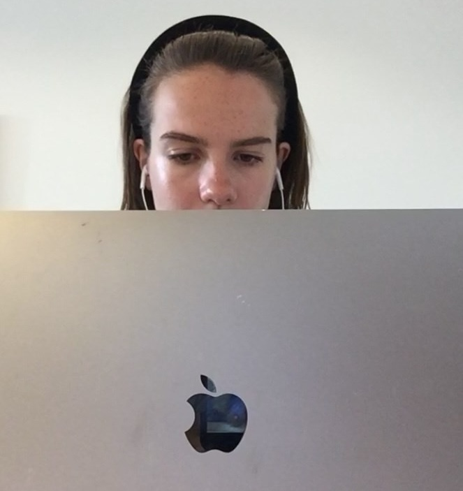

  

**👋** 
I'm India.

**🌱**
I'm currently on a 3-month sabbatical @ [ExplosionAI](https://explosion.ai) to work on [spaCy](https://spacy.io) and [Prodigy](https://prodi.gy). 

**🔎**
I'm usually a Data Scientist at [Nesta](nesta.org.uk), the UK's innovation agency for social good. At Nesta, I primarily build algorithms and open source tools to better understand the UK's labour market. 

**🐍** 
I'm the co-creator of `ojd-daps-skills`, Nesta's [skills extractor python library.](https://pypi.org/project/ojd-daps-skills/) 